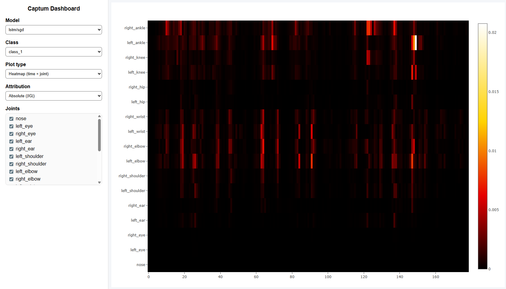
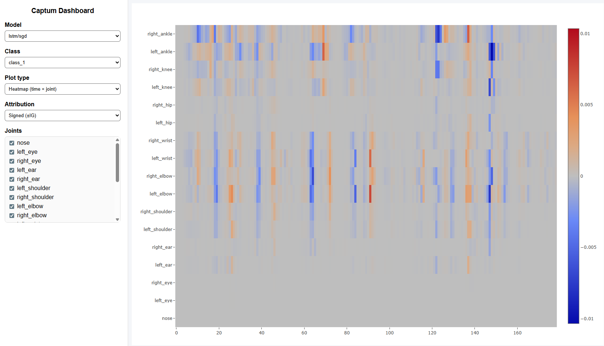
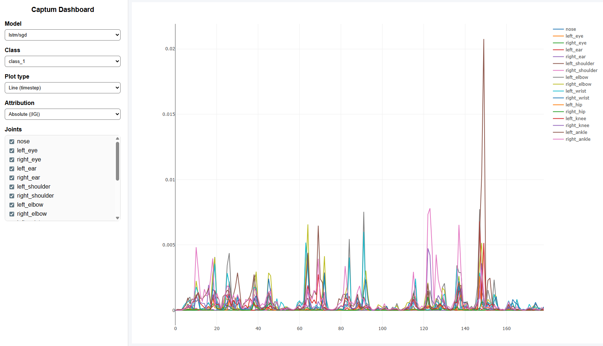
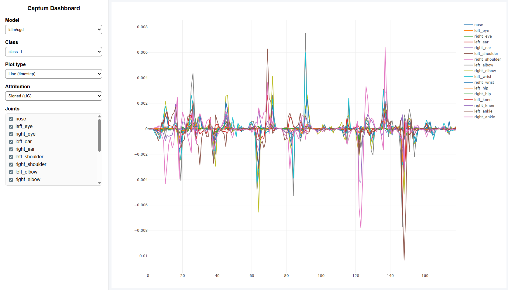
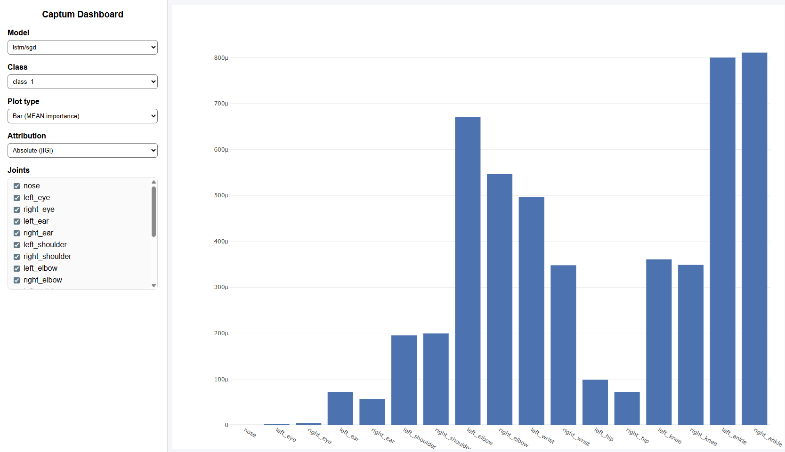
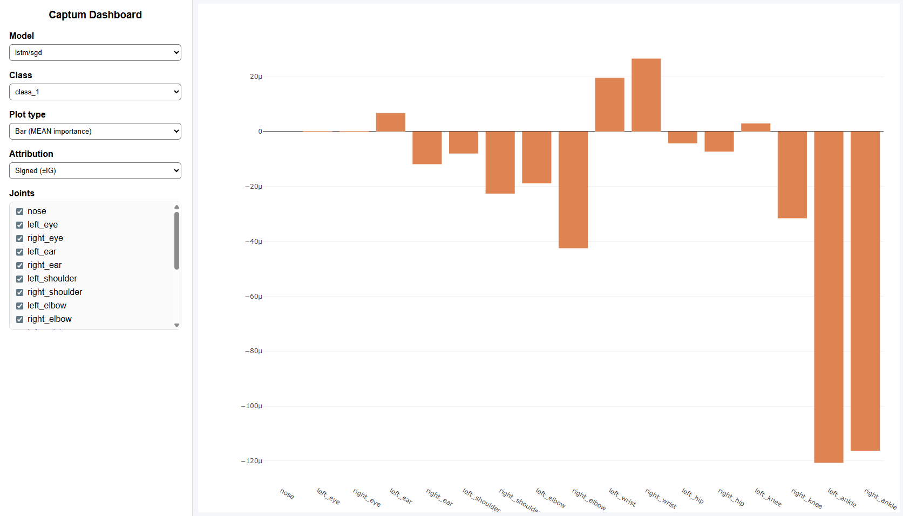

## Captum results for Poomsae detection

### Filter based:
* Model and optimizer type
* Classes (4 Forms)
* Plot types
  * Heat Map
  * Line
  * Bar
* Absolute and Signed Attributions

### URL: 

### DEMO:

| Absolute (\|IG\|) | Signed (±IG)    |
|-------------------|-----------------|
|    |  |
|    |  |
|    |  |
